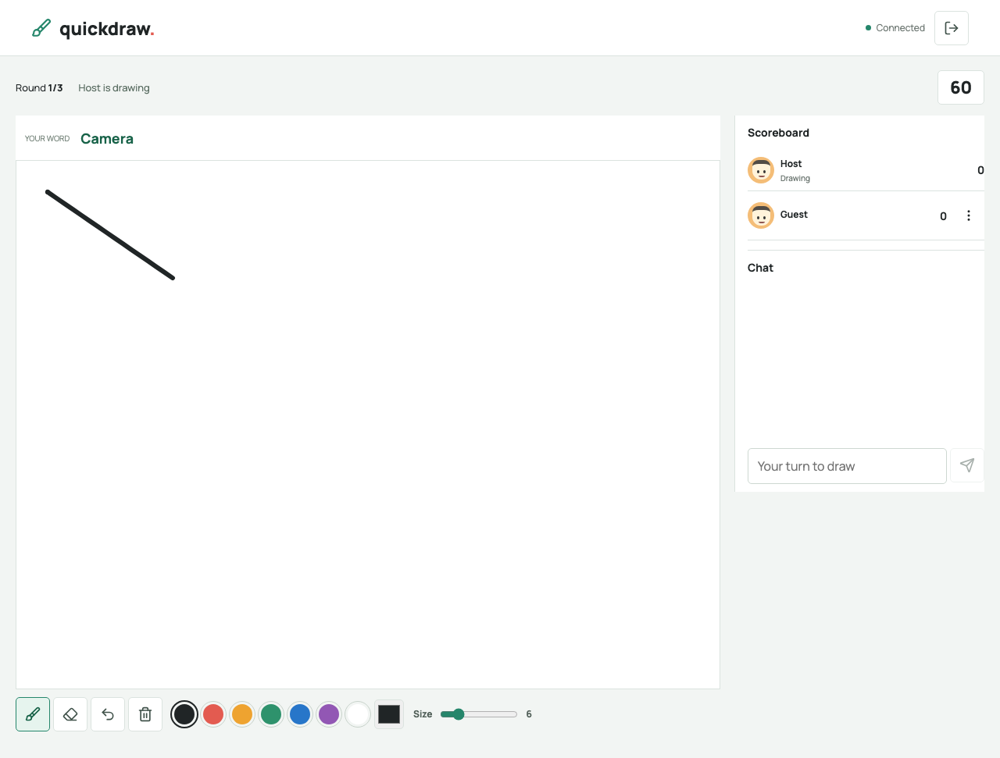
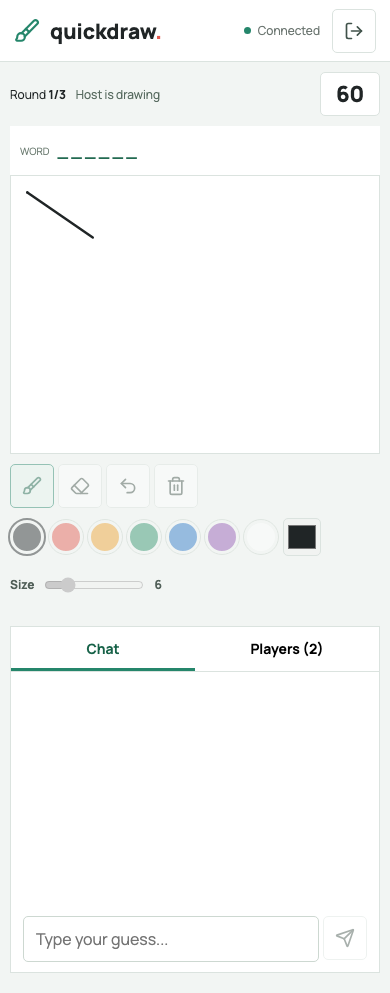
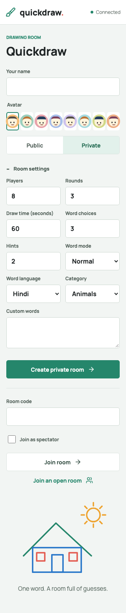
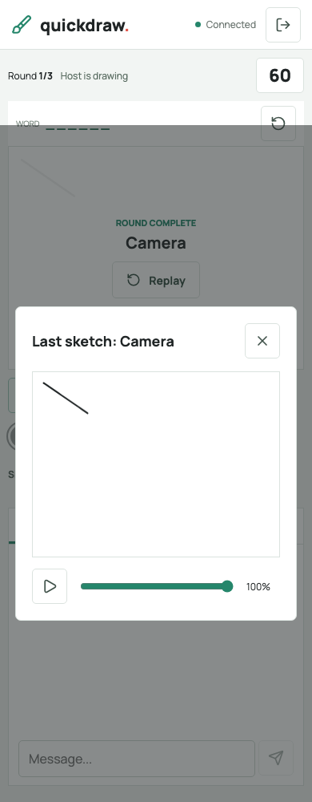

# Quickdraw

A multiplayer drawing and guessing game built with the recommended stack: **React + TypeScript + Vite**, HTML5 Canvas, Node.js, Express and Socket.IO.

Frontend: https://web3task-drawing-game.vercel.app

Backend: https://web3task-drawing-game.onrender.com

These deployment URLs serve the latest version only after the updated repository is redeployed.

## Features

- Public and private rooms, open-room matchmaking, shareable invite links and configurable player limits.
- Open-room matchmaking waits up to 20 seconds, joins as soon as a public lobby has space, and supports cancellation.
- Explicit ready-up, host start controls, rotating drawers, word choices, guesses, speed scoring, leaderboards and winner screens.
- Brush, colors, custom color picker, brush size, eraser, undo and clear.
- Timed hints, hidden/combination modes, custom words, categories, and English/Hindi word lists.
- Host kick/ban, majority votekick and reports delivered to the host.
- Spectators can join a running game without taking turns or scoring. Spectator chat opens between turns.
- Last-round drawing replay with play/pause and a progress slider.
- Canvas restoration on reconnect, disconnect grace, host handoff, and play again.
- Phone layouts with a fixed 4:3 canvas, touch drawing, large controls, and separate Chat/Players tabs.

## Local Development

Requires Node.js **22.12+** (Node 24 LTS is suitable).

```sh
npm ci --include=dev
npm run dev
```

Open http://localhost:5173. Vite serves React and proxies Socket.IO to the Node server on port 3000. If port 3000 is occupied, use `PORT=3108 npm run dev`; Vite uses the same backend port. If Vite's port is occupied, use the alternate URL it prints.

For a production build served directly by Express:

```sh
npm run build
npm start
```

Open http://localhost:3000. To play on a phone on the same Wi-Fi, use the computer's LAN address with the frontend port, for example `http://192.168.1.10:5173`. Phone testing is easiest on the deployed HTTPS Vercel URL; allow local network access through the computer firewall when testing over Wi-Fi.

## Checks

```sh
npm test
npm run typecheck
npm run check
npx playwright install chromium
npm run test:e2e
```

The browser tests use a separate server on port 3107, create independent desktop/mobile player sessions, verify ready-up, actual canvas pixels and drawing sync, reconnect restoration, guesses and scores, replay, touch drawing, all rounds, the winner and play-again. Screenshots are written to ignored `test-results/`.

## Deployment

### Vercel Frontend

Set Root Directory to `drawing-game` if the repository contains that subfolder, Framework Preset to `Other`, Install Command to `npm ci --include=dev`, Build Command to `npm run build`, and Output Directory to `dist`. `vercel.json` supplies these commands; remove conflicting dashboard overrides.

Set **GAME_SERVER_URL** for Production and Preview to `https://web3task-drawing-game.onrender.com`. Save it and redeploy. Vite embeds this public backend origin in the browser bundle and bundles `socket.io-client`; no server-served client library or CDN is required.

### Render Backend

Set Root Directory to `drawing-game` if needed, Build Command to `npm ci --include=dev && npm run build`, and Start Command to `npm start`. Use Node 24 LTS. Set **ALLOWED_ORIGIN** to `https://web3task-drawing-game.vercel.app`, without a trailing slash. `/health` is the health-check endpoint. The included `render.yaml` defines the service commands.

`PORT` defaults to 3000; Render supplies its own port. `ALLOWED_ORIGIN` defaults to `*` for local use. Vercel previews require allowing their origins; the backend accepts a comma-separated list of allowed origins. `GAME_SERVER_URL` is optional for local/Render builds, where the browser connects to its own origin. It is required for Vercel builds.

## Architecture

```text
React components -> Socket.IO events -> Express / gameManager
       |                                      |
       v                                      v
HTML5 Canvas                         Room -> Game + Players
       ^                                      |
       +------ strokes, state, guesses --------+
```

- `client/src/main.tsx`: typed React home, lobby, settings, players, moderation, chat, results and replay controls. A single socket survives view changes; acknowledgement timeouts report failed requests.
- `client/src/Canvas.tsx`: typed pointer capture, normalized points, touch input, canvas rendering and replay. Fixed aspect ratio keeps desktop/mobile drawings proportional.
- `client/src/types.ts`: room, player, drawing, replay, session, acknowledgement and component contracts. Strict TypeScript checks run before every production build.
- `client/index.html`: the single minimal browser entry that mounts React. Lobby and game are React views at `/lobby` and `/game`; Express and Vercel also resolve the old `.html` URLs to this entry.
- `server/models.js`: `Player` owns player state and score resets; `Game` owns drawing state and timers; `Room` extends `Game` with participants, settings and moderation state.
- `server/roomManager.js`: room codes, validation, capacity, spectators, settings, bans and safe public snapshots.
- `server/gameManager.js`: turn order, word privacy, timer deadlines, hints, permission checks, guesses, drawing events, replay, readiness, moderation and reconnection.
- `server/wordManager.js`: categorized English/Hindi pools, custom words and Unicode-aware exact matching.
- `server/scoring.js`: 100 base points plus up to 100 speed points; drawer receives 50 points per correct guess. Every player can score once per turn.

Word matching normalizes NFKC, trims spaces, collapses repeated whitespace and ignores case. Substrings/partial guesses are deliberately not accepted. Words are sent only to the drawer until the turn ends. Suggested event names in the assignment are examples; the application consistently uses its own event names.

Rooms, reports, bans and replays live in memory and are lost when the backend restarts. Use one backend instance; multiple instances require shared game state and Socket.IO coordination. Anonymous room bans block the same session token or name, but are not account-level bans. Reports are host moderation notifications, not an external support inbox. Ready-up is required from every connected non-spectator before the host starts.

## Manual Production Verification

1. Open the Vercel site in separate browser sessions/devices. Create a private room and use Copy invite link to join from the second device.
2. Ready both players and start. Choose a word, draw, undo/erase/clear, and confirm live updates on the other device.
3. Guess correctly and confirm both guesser and drawer scores. Complete the rounds and check the final winner and Play again.
4. Join as a spectator during play. Confirm canvas restoration after reload, blocked drawing/guessing, and last-round replay.
5. Create rooms with Hindi/categories/hidden mode. Verify hints and word choices. Test report, kick/ban and majority votes with additional sessions.
6. Test at 320px/390px portrait and phone landscape; check chat keyboard, touch drawing and control access.

## Screenshots








